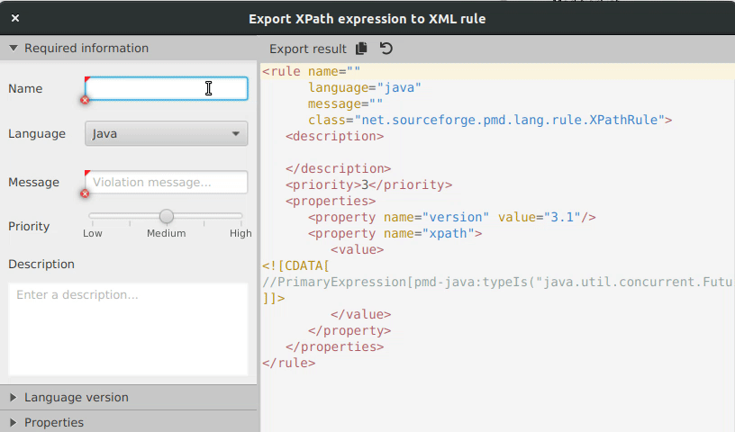

# FX live templates

This library allows rendering an object as a string using a reactive template. The template binds to some object (the "data context") and updates the string representation incrementally, when some properties of the data context change. Bindable properties are regular JavaFX ObservableValues.

Currently it's used in PMD's [Rule Designer](https://github.com/pmd/pmd-designer). Here's a demo:

Originally I built this because the syntax highlighting on the panel to the right is not incremental, so to avoid an enormous glitch every time the text is updated, incremental updates are needed.